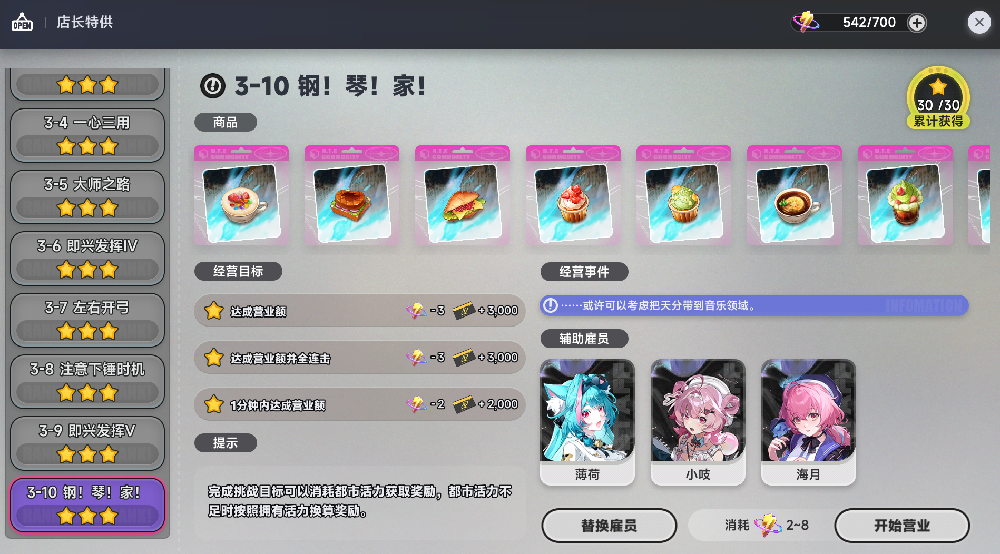

# ☕ NTE Manager's Special Auto-Tool

This tool is based on `OpenCV`, so it cannot run in the background. Please be aware.

Please note: Currently, this tool cannot guarantee a 100% perfect clear rate. Especially in later stages like `3-6` and `3-9`, the perfect clear chance may be under 20%. However, based on my personal testing, it can still achieve a perfect clear after multiple attempts.

Now, Let `Lacrimosa` run the shop for you as the acting manager

[Click to download](https://github.com/HeadmasterTan/NTECoffeeShop/releases)

## 📘 Instructions

* Extract the `zip` file, then run `NTECoffeeShop.exe` `as Administrator`.

* Do not choose `Lacrimosa` as an employee. Ketchup is her wage, so it is not for sale.

* Only supports game resolutions `1920x1080` and `1280x720`.

* Only supports `Windows 10` and `Windows 11`.

* Check `Repeat Stage`, select your desired stage, and start. The tool will loop the selected stage until Urban Vitality is depleted, then it will stop automatically.
	- If you want to dump your Urban Vitality quickly, stage `1-1` is highly recommended.

* Check `Auto-Clear All Stages` and start. The tool will search for stages that haven't reached perfect clear yet and attempt them. If no eligible stages are detected 3 times in a row, the tool will stop automatically.

* Please make sure you are on the screen shown below before enabling this tool.

* Once` Auto-Manage` is running, do not use your computer unless you click `Pause Management`. Otherwise, it will disrupt the tool's operations.

## ✨ Features

1. Auto-loop designated stages
2. Auto-clear stages without perfect clears
3. Multi-language support

## ❔ Q&A

### Q: The food serving speed is too slow.

- Select Yi as your employee and upgrade his talent to Level 3 to increase the patience bar.
- You can lower the game's graphics quality or resolution accordingly.
- Color enhancement or filter features might have been enabled; it is recommended to turn them off.
- If you use an AMD graphics card, try disabling Frame Generation.
- If none of the above fixes it, you might unfortunately have to say goodbye to acting manager `Lacrimosa`.

### Q: Why can't I sell ketchup?

- As I mentioned at the very beginning, ketchup is `Lacrimosa`'s wage. It is strictly not for sale!

## © License

[MIT License](./LICENSE.md)

## 💖 If you like this project

Buy me a coffee 👉 [Click here to sponsor me](https://ifdian.net/a/BaiZhiOpenSource?tab=home)
